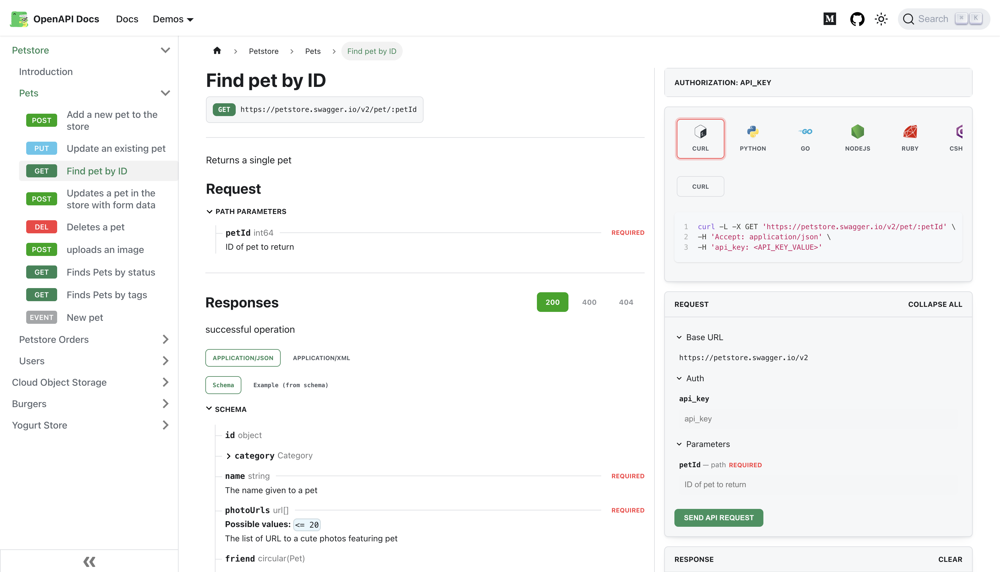

My experience in creating API documentation using OpenAPI, packaged with Docusaurus and aided by the OpenAPI Doc Generator [plugin](https://github.com/PaloAltoNetworks/docusaurus-openapi-docs), has been efficient and rewarding. The combination of these tools simplifies the process, resulting in clear and easy-to-use documentation.

