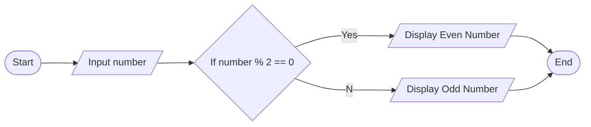

To help users understand complex systems, I usually create visualizations using tools like Mermaid JS, draw.io, Lucidchart, or even Figma for more varied visualizations (as needed). The following diagram is just a small example of my work.

